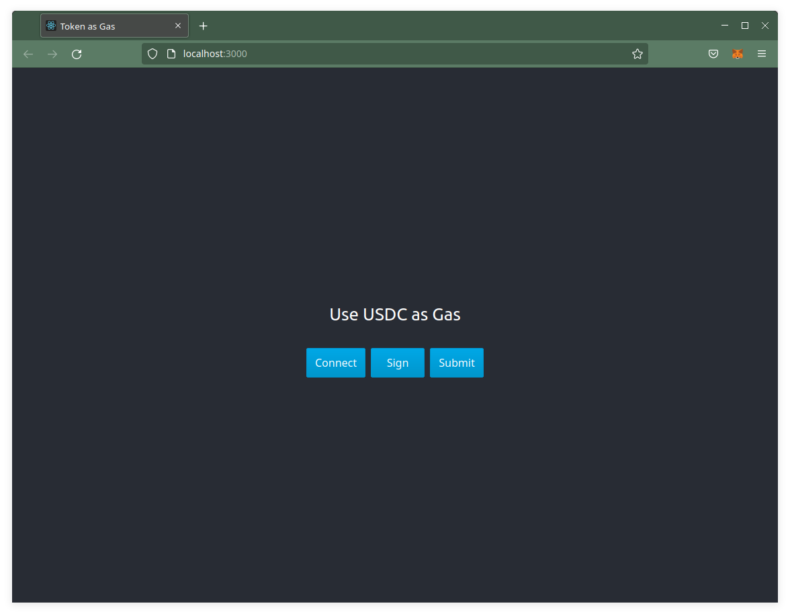
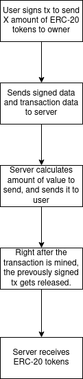

# Token as Gas




## Implementation

This is a simple diagram showcasing a simple overview of how it works:



The Implementation consists a server and a user, the server in this case being a firebase function node.js instance, but you could copy-paste the code into any nodejs runtime. At the moment, for simplicity reasons, I just implemented getting gas for a simple transaction (no data, so 21000 units of gas), but I made it easy to add custom gas numbers if you want.

To run it yourself you need to create a `.env` file in the `./backend_firebase` directory, this is a sample:

```bash
INFURA_URL="https://rinkeby.infura.io/v3/YOUR_KEY"
YOUR_ADDRESS="0x3a4e6eD8B0F02BFBfaA3C6506Af2DB939eA5798c"
TOKEN_ADDRESS="0xA0b86991c6218b36c1d19D4a2e9Eb0cE3606eB48" # USDC token
PRIVATE_KEY="0x0"
```

And in the file `App.js` you need to change variables `YOUR_ADDRESS` and `TOKEN_ADDRESS`, and to let the user connect with a wallet, add an Infura JSON-RPC Url in the `getProvider.js` file at the line 13.

Caution: This is still a prototype and it needs more safe-guards for production, so use it with caution!

## Opportunity for owner

The owner, in this case the person running the server and exposing this service to users, can benefit from arbitrage opportunities, for example buying eth for cheaper and then "selling" it as gas with an added premium. 

## Current problems

Metamask, which is currently the biggest wallet i think, is not supported, because they disabled the ability to sign a transaction without sending it. The one wallet that I found was working is the Coinbase Wallet, but it only lets you sign a transaction if you have enough gas to pay for it (wtf?). Perhaps there are other wallets that have better support, you can create an Issue if you found one.

## Buy me coffee

If you like my work, please consider buying me a coffee at `mhaas.eth` or `0x3a4e6eD8B0F02BFBfaA3C6506Af2DB939eA5798c`. Thanks!
